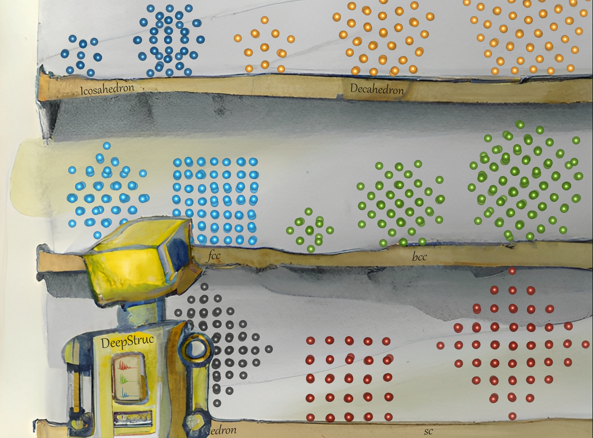

**Using generative models for structure solution from pair distribution function data**  
Crystallographic methods, such as single crystal and powder diffraction, allow establishing the links between material structure and properties that are at the heart of materials development. However, other approaches for atomic-scale structure determination are needed for nanostructured materials that have limited long-range order. Over the past decades, Pair Distribution Function (PDF) analysis has become a core tool for analysis of nanomaterial structure. Currently, PDF analysis is mainly done by fitting a known starting model to an experimental PDF to extract quantitative structural information. However, identifying a model or solving a structure de novo, from a PDF, is still an enormous challenge. I develop ML models that can identify the structural model from a PDF, extract structural motifs from the PDF or in some cases solve a simple nanoparticle structure directly from a PDF.  
**Collaborators:** I collaborated with the [Nanostructure Group UPCH](https://nanostructure-cph.com/), University of Copenhagen, lead by Assoc. Prof. [Kirsten Marie Ørnsbjerg Jensen](https://scholar.google.com/citations?user=0LD11kYAAAAJ&hl=da&oi=ao), with Professor [Simon J. L. Billinge](https://scholar.google.com/citations?user=dRmx8foAAAAJ&hl=en) from Columbia University, with [Assistant Professor Raghavendra Selvan](https://raghavian.github.io/) from Department of Computer Science, UCPH and with Senior Lecturer [Keith Tobias Butler](https://mdi-group.github.io/) from University College London.

**Papers - Identifying the structural model from a PDF:** 
1. [POMFinder: identifying polyoxometallate cluster structures from pair distribution function data using explainable machine learning](https://journals.iucr.org/j/issues/2024/01/00/in5097/index.html)
 

**Papers - Solving the structure from a PDF:** 
1. [DeepStruc: Towards structure solution from pair distribution function data using deep generative models](https://pubs.rsc.org/en/content/articlehtml/2022/dd/d2dd00086e)  
2. [Characterising the atomic structure of mono-metallic nanoparticles from x-ray scattering data using conditional generative models](https://par.nsf.gov/biblio/10300745)
 

**Papers - Extracting structural motifs from a PDF:**  
1. [Extracting structural motifs from pair distribution function data of nanostructures using explainable machine learning](https://www.nature.com/articles/s41524-022-00896-3) highlighted in [MAX IV annual report 2022](https://www.maxiv.lu.se/wp-content/plugins/sharepoint-plugin/ajax/downloadFile.php?site_id=MAXIV&version_series_id=71&repository_id=0fbdb5b5-c377-4ff8-9350-6889fdf4c076)  
2. [Characterisation of intergrowth in metal oxide materials using structure-mining: the case of γ-MnO2](https://pubs.rsc.org/en/content/articlehtml/2022/dt/d2dt02153f)  
3. [Atomic structural changes in the formation of transition metal tungstates: the role of polyoxometalate structures in material crystallization](https://pubs.rsc.org/en/content/articlehtml/2023/sc/d3sc00426k)  
4. [ClusterFinder: a fast tool to find cluster structures from pair distribution function data](https://journals.iucr.org/a/issues/2024/02/00/tw5008/index.html)
 

**Papers - Other related papers:** 
1. [Machine learning for analysis of experimental scattering and spectroscopy data in materials chemistry](https://pubs.rsc.org/en/content/articlehtml/2023/sc/d3sc05081e)  
2. [A GPU-Accelerated Open-Source Python Package for Calculating Powder Diffraction, Small-Angle-, and Total Scattering with the Debye Scattering Equation](https://joss.theoj.org/papers/10.21105/joss.06024)  
3. [CHILI: Chemically-Informed Large-scale Inorganic Nanomaterials Dataset for Advancing Graph Machine Learning](https://arxiv.org/abs/2402.13221)
 
